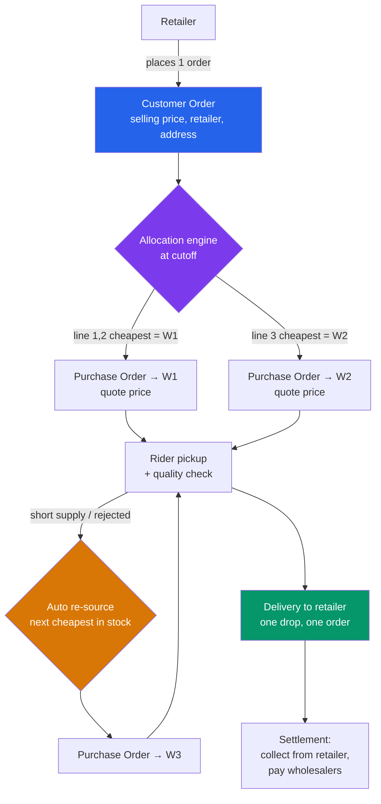
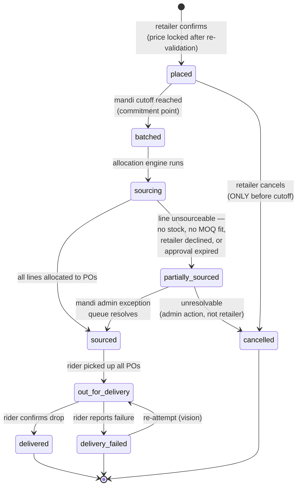
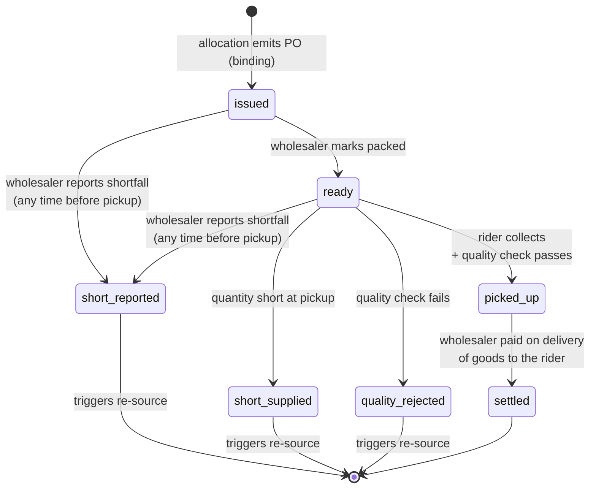
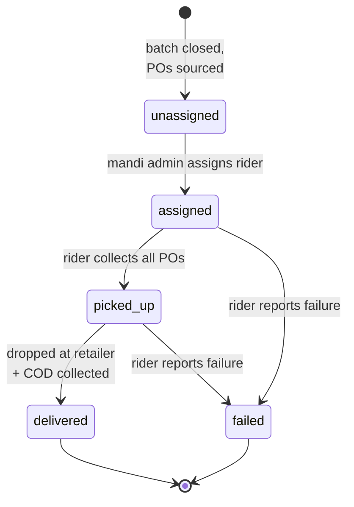
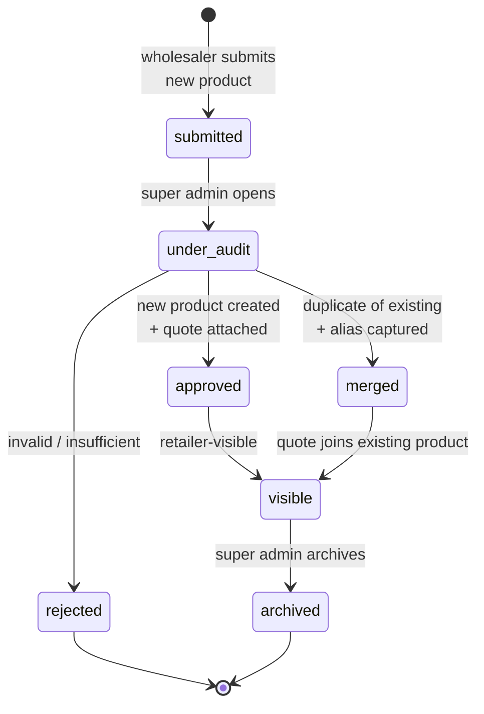
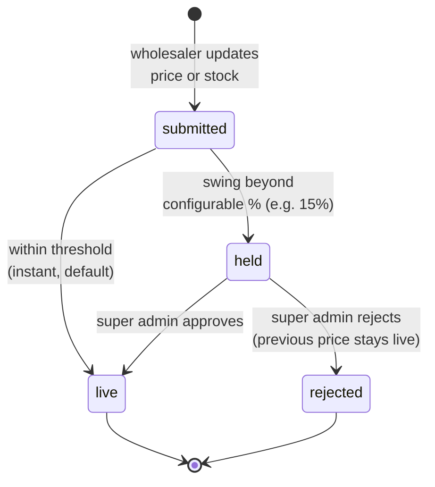

# Mandi Bhai — Product Requirements Document

**Version:** 1.0
**Date:** 2026-08-13
**Status:** Draft for build
**Companion document:** [`BRD.md`](./BRD.md) — business case, model economics, rollout.

**Repository state this document was written against:** commit `b744600`, branch `main`.

---

## 1. Goals and non-goals

### 1.1 Goals

| # | Goal |
|---|---|
| G1 | A retailer places **one order** with Mandi Bhai and receives one next-morning delivery |
| G2 | Wholesaler identity is **never** visible to the retailer, in any surface or payload |
| G3 | Selling price is derived as **min available quote × (1 + markup%)**, computed by the platform |
| G4 | Retailer sees selling price and **mandi average** as a savings anchor; never the raw minimum quote |
| G5 | Sourcing is **fully automatic** — cheapest in-stock wholesaler meeting MOQ — with no human in the daily loop |
| G6 | Short supply or quality rejection **auto re-sources** from the next-cheapest wholesaler, invisibly to the retailer |
| G7 | Price and stock are re-validated at **cart-open and place-order**, with explicit retailer confirmation on any change |
| G8 | New products are **audited by a super admin** (identity + duplicate check) before retailer visibility |
| G9 | Price updates on approved products go live **instantly**, unless they breach a configurable % threshold |
| G10 | A **super admin** owns catalogue, markup, MOQ overrides, cutoffs, mandis, and margin reporting |
| G11 | **Margin is visible to the super admin only** |
| G12 | Payments are COD + online prepaid, with the gateway **stubbed behind a swappable interface** |

### 1.2 Non-goals (v1)

| # | Non-goal | Note |
|---|---|---|
| N1 | Udhaar / credit | **Removed from v1.** Existing module descoped — see §9.4 |
| N2 | Retailer choosing a supplier | Contradicts the model entirely |
| N3 | Showing the raw minimum quote to retailers | Would expose the markup |
| N4 | Real third-party integrations | All stubbed — see §12 |
| N5 | Same-day delivery | One batch per mandi per day, next morning |
| N6 | Partial delivery / returns | Order delivers in full or fails |
| N7 | Multi-city | Single city, mandi-scoped |
| N8 | Separate web admin console | Admin screens live in the existing RN app |
| N9 | Wholesaler business/identity KYC | Explicitly reframed — the audit is of *products*, not businesses (§6.1) |
| N10 | Route optimisation, geocoding, rider batching by proximity | Vision tier |

---

## 2. Personas and role matrix

### 2.1 Roles

| Role | Code status | Scope | Owns |
|---|---|---|---|
| **Retailer** | Exists (`retailer`) | Global | Browsing, cart, orders, payment |
| **Wholesaler** | Exists (`wholesaler`) | One mandi | Own quotes (price/stock/MOQ), new-product submissions |
| **Mandi admin** | Exists (`mandi_admin`) | One mandi | Local ops: allocation overrides, rider assignment, exception queue |
| **Super admin** | **DOES NOT EXIST** | Platform-wide | Master catalogue, product audit, markup, MOQ override, cutoffs, mandi creation, margin reporting |
| **Delivery partner / rider** | Exists (`delivery_partner`), seeded only | One mandi | Pickup, quality check, delivery, COD collection |

Roles are implemented in `backend/src/auth/guards/roles.decorator.ts` + `roles.guard.ts`, and enumerated in `backend/src/auth/jwt.types.ts`. Adding `super_admin` requires a new profile entity, a new guard value, and a new navigator branch in `frontend/App.tsx`.

### 2.2 Visibility matrix — the enforcement contract

| Data | Retailer | Wholesaler | Mandi admin | Super admin |
|---|---|---|---|---|
| Selling price | ✅ | ❌ | ✅ | ✅ |
| Mandi average rate | ✅ | ❌ | ✅ | ✅ |
| **Minimum quote (sourcing price)** | **❌** | Own only | ❌ | ✅ |
| All wholesaler quotes per product | ❌ | Own only | ❌ | ✅ |
| Min / average / spread analytics | ❌ | ❌ | ❌ | ✅ |
| Markup % config | ❌ | ❌ | ❌ | ✅ |
| **Margin earned** | ❌ | ❌ | **❌** | **✅ only** |
| Supplier identity on an order | **❌** | n/a | ✅ | ✅ |
| Retailer identity | n/a | **❌** | ✅ | ✅ |
| Own stock / MOQ | ❌ | ✅ | ✅ | ✅ |
| Purchase orders | ❌ | Own only | ✅ (own mandi) | ✅ |

Every ❌ in the retailer and wholesaler columns is a testable assertion. §4.1 lists where the current code violates them.

---

## 3. Current implementation inventory

Verified against the repository. This is the baseline every "Shipped today" tier below refers to.

### 3.1 Entities (19, all registered in `backend/src/app.module.ts`)

| Module | Entities |
|---|---|
| `entities/` | `User`, `RetailerProfile`, `WholesalerProfile`, `MandiAdminProfile`, `DeliveryPartnerProfile` |
| `mandis/` | `Mandi` |
| `auth/` | `OtpRequest` |
| `catalog/` | `Category`, `Product`, `ProductAlias` |
| `listings/` | `WholesalerListing` |
| `cart/` | `Cart`, `CartItem` |
| `orders/` | `Order`, `OrderItem` |
| `delivery/` | `Delivery` |
| `wallet/` | `UdhaarAccount`, `UdhaarTransaction`, `Payment` |

### 3.2 Endpoints

| Method + path | Guard | File |
|---|---|---|
| `GET /health` | — | `health/health.controller.ts` |
| `GET /mandis` | — | `mandis/mandis.controller.ts` |
| `POST /auth/otp/request` | — | `auth/auth.controller.ts` |
| `POST /auth/otp/verify` | — | `auth/auth.controller.ts` |
| `GET /auth/me` | JWT | `auth/auth.controller.ts` |
| `POST /auth/profiles/retailer` | JWT | `auth/auth.controller.ts` |
| `POST /auth/profiles/wholesaler` | JWT | `auth/auth.controller.ts` |
| `PATCH /auth/profiles/retailer/address` | JWT | `auth/auth.controller.ts` |
| `PATCH /auth/profiles/wholesaler/address` | JWT | `auth/auth.controller.ts` |
| `GET /categories` | — | `catalog/catalog.controller.ts` |
| `GET /products` | — | `catalog/catalog.controller.ts` |
| `GET /products/:id` | — | `catalog/catalog.controller.ts` |
| `POST /admin/products` | `mandi_admin` | `catalog/admin-catalog.controller.ts` |
| `PATCH /admin/products/:id` | `mandi_admin` | `catalog/admin-catalog.controller.ts` |
| `GET /admin/products/:id/aliases` | `mandi_admin` | `catalog/admin-catalog.controller.ts` |
| `POST /admin/products/:id/aliases` | `mandi_admin` | `catalog/admin-catalog.controller.ts` |
| `DELETE /admin/products/:id/aliases/:aliasId` | `mandi_admin` | `catalog/admin-catalog.controller.ts` |
| `GET /wholesaler/listings` | `wholesaler` | `listings/wholesaler-listings.controller.ts` |
| `POST /wholesaler/listings` | `wholesaler` | `listings/wholesaler-listings.controller.ts` |
| `PATCH /wholesaler/listings/:id` | `wholesaler` | `listings/wholesaler-listings.controller.ts` |
| `DELETE /wholesaler/listings/:id` | `wholesaler` | `listings/wholesaler-listings.controller.ts` |
| `GET /cart` | `retailer` | `cart/cart.controller.ts` |
| `POST /cart/items` | `retailer` | `cart/cart.controller.ts` |
| `PATCH /cart/items/:id` | `retailer` | `cart/cart.controller.ts` |
| `DELETE /cart/items/:id` | `retailer` | `cart/cart.controller.ts` |
| `POST /checkout` | `retailer` | `orders/retailer-orders.controller.ts` |
| `GET /orders` | `retailer` | `orders/retailer-orders.controller.ts` |
| `GET /orders/:id` | `retailer` | `orders/retailer-orders.controller.ts` |
| `POST /orders/:id/cancel` | `retailer` | `orders/retailer-orders.controller.ts` |
| `GET /wholesaler/orders` | `wholesaler` | `orders/wholesaler-orders.controller.ts` |
| `GET /wholesaler/orders/:id` | `wholesaler` | `orders/wholesaler-orders.controller.ts` |
| `POST /wholesaler/orders/:id/confirm` | `wholesaler` | `orders/wholesaler-orders.controller.ts` |
| `POST /wholesaler/orders/:id/reject` | `wholesaler` | `orders/wholesaler-orders.controller.ts` |
| `POST /wholesaler/orders/:id/pack` | `wholesaler` | `orders/wholesaler-orders.controller.ts` |
| `GET /admin/deliveries` | `mandi_admin` | `delivery/admin-delivery.controller.ts` |
| `GET /admin/deliveries/partners` | `mandi_admin` | `delivery/admin-delivery.controller.ts` |
| `POST /admin/deliveries/:id/assign` | `mandi_admin` | `delivery/admin-delivery.controller.ts` |
| `GET /rider/deliveries` | `delivery_partner` | `delivery/rider-delivery.controller.ts` |
| `POST /rider/deliveries/:id/picked-up` | `delivery_partner` | `delivery/rider-delivery.controller.ts` |
| `POST /rider/deliveries/:id/delivered` | `delivery_partner` | `delivery/rider-delivery.controller.ts` |
| `POST /rider/deliveries/:id/failed` | `delivery_partner` | `delivery/rider-delivery.controller.ts` |
| `GET /wallet/me` | `retailer` | `wallet/wallet.controller.ts` |
| `PATCH /admin/wallet/:retailerProfileId/limit` | `mandi_admin` | `wallet/admin-wallet.controller.ts` |
| `POST /admin/wallet/:retailerProfileId/repayment` | `mandi_admin` | `wallet/admin-wallet.controller.ts` |

### 3.3 Frontend screens

| Role | Screens |
|---|---|
| Entry | `PhoneScreen`, `OtpScreen`, `CreateProfileScreen` |
| Retailer (`src/screens/retailer/`) | `HomeScreen`, `CategoriesScreen`, `BuyAgainScreen`, `OrdersScreen`, `ProfileScreen`, `ProductDetailScreen`, `CartScreen`, `CheckoutScreen`, `OrderDetailScreen`, `WalletScreen` |
| Wholesaler (`src/screens/wholesaler/`) | `InventoryScreen`, `CatalogueScreen`, `WholesalerOrdersScreen`, `WholesalerProfileScreen`, `ListingFormScreen`, `WholesalerOrderDetailScreen` |
| Mandi admin | `MandiAdminHomeScreen` |
| Rider | `RiderHomeScreen` |

Routing is by profile role in `frontend/App.tsx`. The API contract is `frontend/src/api/client.ts`.

---

## 4. Gap: built vs. required

**This is the most important section of this document.** The shipped code implements an open marketplace. The business model is a managed reseller. The two are incompatible in their commercial core, and the difference is not cosmetic.

### 4.1 Supplier identity leaks — every occurrence

Requirement G2 says the retailer must never learn which wholesaler supplied the goods. The code currently exposes it in **six backend payloads, six API client types, and six UI surfaces**. Each is a separate required change.

| # | Location | What leaks | Required change |
|---|---|---|---|
| **L1** | `backend/src/catalog/catalog.service.ts:157-189` (`sellersFor`) → `GET /products/:id` | Full `sellers[]` array: `wholesalerName`, `mandiName`, `mandiCity`, per-seller `pricePerUnit`, `mrp`, `moq`, `stockUnits`, `isBestPrice` | Delete the array. Return one platform price object: `sellingPrice`, `mandiAverage`, `savingsVsAverage`, `effectiveMoq`, `availability` |
| **L2** | `backend/src/catalog/catalog.service.ts:101-131` (`offerSummaryFor`) → `GET /products` | `offers.sellerCount` (reveals supplier multiplicity) and `offers.lowestPrice` — **the raw minimum quote, which G4 forbids showing** | Replace with `{ sellingPrice, mandiAverage, inStock }`. `lowestPrice` must never reach a retailer response |
| **L3** | `backend/src/cart/cart.service.ts:127-128` | Per-item `wholesalerName` and `wholesalerProfileId` | Remove both from the retailer cart payload |
| **L4** | `backend/src/cart/cart.service.ts:140-163` | `wholesalerGroups[]` — the cart is literally grouped and subtotalled by supplier | Remove the grouping entirely. One cart, one subtotal |
| **L5** | `backend/src/orders/orders.service.ts:447` (`toOrderSummary`) → `GET /orders`, `GET /orders/:id`, `POST /checkout` | `wholesalerName` on every retailer-facing order summary and detail | Remove from retailer responses. Supplier moves to the internal PO |
| **L6** | `backend/src/delivery/delivery.service.ts:301` (`toDeliveryView`) | `order.wholesalerName` — correct for admin/rider, but it is the **same shared shape** typed as `DeliveryView` | Split the view: admin/rider keep supplier; any retailer-reachable delivery view must not |
| **L7** | `backend/src/orders/order.entity.ts:61-65` | `Order.wholesalerProfileId` — the customer order is structurally bound to one supplier | Remove from customer `Order`. Supplier belongs on `PurchaseOrder` |
| **L8** | `frontend/src/api/client.ts:82-94` | `Seller` type | Delete |
| **L9** | `frontend/src/api/client.ts:64-67` | `Offers.sellerCount`, `Offers.lowestPrice` | Replace with platform-price shape |
| **L10** | `frontend/src/api/client.ts:317-318` | `CartLineItem.wholesalerName`, `.wholesalerProfileId` | Delete |
| **L11** | `frontend/src/api/client.ts:334-339` | `CartView.wholesalerGroups` | Delete |
| **L12** | `frontend/src/api/client.ts:395` | `OrderSummary.wholesalerName` | Delete (retailer-facing) |
| **L13** | `frontend/src/api/client.ts:483` | `DeliveryView.order.wholesalerName` | Keep for admin/rider types only; split the type |
| **L14** | `frontend/src/screens/retailer/ProductDetailScreen.tsx:135-215` | Renders the whole seller comparison list — supplier names, per-seller MOQ, mandi name, "BEST PRICE" badge | Replace with a single platform price block |
| **L15** | `frontend/src/components/ProductCard.tsx:37-43` | Renders "N sellers" / "No sellers yet" on every product tile | Replace with availability + savings-vs-average |
| **L16** | `frontend/src/screens/retailer/CartScreen.tsx:96-100` | Renders `group.wholesalerName` section headers | Single ungrouped list |
| **L17** | `frontend/src/screens/retailer/CheckoutScreen.tsx:147-159` | Renders per-wholesaler subtotals **and the text "This will create N separate orders, one per wholesaler."** | Single order summary |
| **L18** | `frontend/src/screens/retailer/OrdersScreen.tsx:103` | Renders `wholesalerName` on each order row | Remove |
| **L19** | `frontend/src/screens/retailer/OrderDetailScreen.tsx:111` | Renders `wholesalerName` as an order field | Remove |

### 4.2 Structural gaps

| # | Gap | Current state | Required |
|---|---|---|---|
| **S1** | **No markup concept anywhere** | Zero occurrences of markup/margin in the codebase. `WholesalerListing.pricePerUnit` is what the retailer pays | `ProductMarkup` entity; pricing service deriving selling price |
| **S2** | **No super admin role** | `JwtPayload.profiles` is `retailer \| wholesaler \| mandi_admin \| delivery_partner` | New `SuperAdminProfile`, guard value, navigator branch |
| **S3** | **Checkout fans out into one Order per wholesaler** | `orders.service.ts:166-230` groups cart items by `wholesalerProfileId` and creates N orders | One customer `Order` + N internal `PurchaseOrder`s |
| **S4** | **No allocation engine** | The retailer picks a listing; `CartItem.wholesalerListingId` binds the choice at add-to-cart | Automatic cheapest-in-stock-meeting-MOQ selection at batch time. Cart items must reference `productId`, not a listing |
| **S5** | **No cutoff / batch-window concept** | `Mandi` has only `id`, `name`, `city`, `createdAt`. Orders flow continuously | `Mandi.cutoffTime`, `deliveryWindow`, timezone; `DeliveryBatch` entity |
| **S6** | **No mandi-average computation** | `offerSummaryFor` computes `MIN` and `COUNT` only | `AVG` across all active quotes, stored/snapshotted for display and audit |
| **S7** | **No price-change confirmation flow** | Cart reads live price and flags `belowMoq` / `overStock` / `unavailable`; checkout re-locks and re-checks. But there is **no price-delta detection and no confirmation gate** | Snapshot price at cart-open; compare at open and at place-order; require explicit confirm |
| **S8** | **Product approval never built** | `SkuSubmission` (PLAN-products-kyc Phase 3) does not exist. Wholesalers can create listings against any active product immediately | Submission entity, audit queue, duplicate detection, approval gate |
| **S9** | **KYC never built** | PLAN Phase 4 — no `KycSubmission`, `KycDocument`, or `StorageService` | Reframed: not needed as business KYC. The audit is of products (§6.1) |
| **S10** | **Udhaar built but descoped** | `UdhaarAccount`, `UdhaarTransaction`, wallet endpoints, `WalletScreen` all working | Park the ledger; keep `Payment`; see §9.4 |
| **S11** | **`synchronize: true`** | `app.module.ts:73` — auto-syncs schema from entities on boot | TypeORM migrations before any real data |
| **S12** | **No price-change audit trail** | `listings.service.ts:120-122` overwrites `pricePerUnit` in place, no history | `PriceChangeLog` entity; required for threshold approvals and margin forensics |
| **S13** | **Mandi admin owns the master catalogue** | `admin-catalog.controller.ts:31` is `@Roles('mandi_admin')`, and products are global — so any mandi admin edits every mandi's catalogue | Move to `super_admin` |
| **S14** | **Mandi admin owns credit limits** | `admin-wallet.controller.ts` — moot once Udhaar is descoped | Remove with S10 |
| **S15** | **Order status merges two lifecycles** | `OrderStatus` includes wholesaler states (`confirmed`, `rejected`, `packed`) on the customer order | Customer order gets its own lifecycle; wholesaler states move to PO |
| **S16** | **`PaymentMethod` enum has no online option** | `order.entity.ts:26-29` — `cod \| udhaar` only | `cod \| prepaid`; drop `udhaar` |

### 4.3 Corrections to prior documentation

Two claims in the existing docs are **stale or inaccurate** against the code, and the build team should not act on them as written:

| Claim | Source | Reality |
|---|---|---|
| "MOQ is captured and displayed but nothing enforces it yet" | `TODO.md` line 45 | **Stale.** MOQ *is* enforced: `orders.service.ts:97-101` rejects checkout below MOQ naming the product, and `cart.service.ts:111` flags `belowMoq` which gates `canCheckout`. What is missing is MOQ enforcement under *automatic allocation*, a different problem — now resolved as a hard constraint (§18, D1) |
| "No cart/checkout re-validation" | pivot brief | **Partially inaccurate.** Stock/MOQ/availability *are* re-validated — cart reads live listing values, and checkout row-locks with `pessimistic_write` and re-checks (`orders.service.ts:146-164`). What is genuinely missing is **price-delta detection and the confirmation gate** (S7) |

---

## 5. Pricing and markup engine

### 5.1 Specification

**Inputs:** all `active` quotes for a product **in the retailer's own mandi** (resolved — D6); the per-product markup %; optional MOQ override.

**Derivation**

```
# Scope: quotes are always confined to the retailer's own mandi.
mandiQuotes     = active quotes for this product in this mandi

# 1. Sourcing minimum MUST come from an in-stock quote.
availableQuotes = mandiQuotes where stockUnits > 0
minQuote        = MIN(availableQuotes.price)               # internal only, never displayed

# 2. Average pool = the in-stock minimum, plus every quote priced ABOVE it
#    (in stock or not). Quotes priced BELOW the minimum — i.e. cheaper but
#    out of stock — are EXCLUDED from the pool.
averagePool     = { minQuote } ∪ { q in mandiQuotes : q.price > minQuote }
mandiAverage    = MEAN(averagePool)

markupPct       = ProductMarkup.percent (default from config)
sellingPrice    = round(minQuote × (1 + markupPct/100), 2)
savingsVsAvg    = max(0, mandiAverage − sellingPrice)      # clamped, never negative
effectiveMoq    = MOQ of the wholesaler holding minQuote, unless super admin override exists
```

**Why cheaper-but-out-of-stock quotes are excluded from the pool:** a quote the platform cannot actually buy at is not a real market rate. Including it would drag the average down toward a price nobody can transact at, understating the saving against rates that are genuinely available.

**Degenerate case:** if no quote sits above the minimum, the pool is `{ minQuote }` alone, so `mandiAverage` equals that price and **displayed savings is 0**.

**Honest characterisation of the bias:** because out-of-stock quotes *above* the minimum stay in the pool, this average runs **higher than a strictly in-stock average would**. That is a deliberate choice, recorded as such.

**Display property:** savings is clamped at zero and suppressed when non-positive, so **it can never render negative**. Note this is a property of the clamp, not of the arithmetic — with a tight spread (e.g. quotes ₹38 and ₹39, both in stock, 10% markup → selling ₹41.80 vs. average ₹38.50) the raw difference *is* negative, and the clamp is what prevents it surfacing. The savings block is hidden entirely in that case rather than showing “₹0 saved”.

**Rounding:** half-up to 2 decimals at the unit level; line total = `sellingPrice × quantity`, rounded once.

**Granularity:** markup is a **percentage per product** (D3). Category-level defaults are a future convenience for large catalogues, not a v1 requirement.

### 5.2 Tiers

| Tier | Scope |
|---|---|
| **Shipped today** | Flat `pricePerUnit` per listing; optional per-listing `mrp`; `savingsVsMrp` computed in `catalog.service.ts:182` and `listings.service.ts`; MRP≥price validation in `listings.service.ts:145-151`; `MIN`/`COUNT` aggregate in `offerSummaryFor` |
| **Next** | `ProductMarkup` entity; pricing service; mandi-average computation; selling-price derivation; retailer payloads carrying only `sellingPrice` + `mandiAverage` + `savingsVsAverage`; super admin markup CRUD; margin computation and reporting; `PriceChangeLog`; threshold-based price approval |
| **Vision** | Category/mandi-level markup policies; demand- and stock-elastic dynamic markup; price trend history; competitor rate intelligence; forward pricing on volatile commodities |

### 5.3 Acceptance criteria

- **AC-P1** Given quotes 38/42/48 in stock and 56 out of stock, and markup 10%, `GET /products/:id` returns `sellingPrice: 41.80` and `mandiAverage: 46.00` — pool = {38, 42, 48, 56}, mean 46.00.
- **AC-P2** No retailer-facing response contains the minimum quote, any individual quote, `sellerCount`, or any wholesaler identifier. Enforced by contract test over every retailer endpoint.
- **AC-P3** A super admin changing markup from 10% to 12% changes the selling price on the next read; orders already placed are unaffected (price snapshotted on the order).
- **AC-P4** Margin appears in exactly one API surface, guarded by `@Roles('super_admin')`.
- **AC-P5** When the only in-stock quote is withdrawn, the product reports unavailable rather than falling back to an out-of-stock quote's price.
- **AC-P6** Given an out-of-stock quote at ₹30 and in-stock quotes at 38/42, the ₹30 quote is **excluded** from the average pool: minimum is ₹38, pool is {38, 42}, average ₹40.00.
- **AC-P7** Given a single in-stock quote and no quotes above it, `mandiAverage` equals that quote and the savings block is **not rendered**.
- **AC-P8** Given quotes ₹38 and ₹39 both in stock with 10% markup, selling price is ₹41.80, raw savings is negative, and the response reports savings as 0 with the display suppressed — never a negative number.
- **AC-P9** Quotes from a mandi other than the retailer's own never enter either the minimum or the average pool.

---

## 6. Catalogue and product audit

### 6.1 Reframing: this is a product audit, not KYC

The prior plan (`PLAN-products-kyc.md` §2, Phase 4) specified business KYC — GSTIN, PAN, shop proof, document upload, government verification. **That is out of scope.** What is required instead is an audit of the **products a wholesaler submits**.

| Submission type | Review scope | Approver |
|---|---|---|
| **New product** | **Full audit** — name, brand, category, structured pack size from the fixed unit list, *and* duplicate check against the existing catalogue with merge suggestion | Super admin |
| **Existing product** | **Price only** | Instant, unless threshold breached (§7.3) |

A product is **invisible to retailers until the super admin approves it**.

### 6.2 Why duplicate detection is a commercial control

If the same real-world product exists as two catalogue entries, quotes split across them. Each entry's computed minimum rises, the retailer's savings claim collapses, and sourcing cannot consolidate. Duplicate detection is therefore a **pricing correctness requirement**, not data hygiene. See [`BRD.md` §6.3](./BRD.md) for the worked example.

The building blocks already exist: `packBaseValue`/`packBaseUnit` canonicalisation (`catalog/pack-unit.ts`) already collapses "1 dozen" and "12 piece" to the same base, and is indexed on `Product` (`@Index(['packBaseValue', 'packBaseUnit'])`).

### 6.3 Tiers

| Tier | Scope |
|---|---|
| **Shipped today** | `Category`, `Product` (global, `active`/`archived`), `ProductAlias` with `normalised` column and locale detection; structured pack sizes with canonical base units; admin product + alias CRUD (`admin-catalog.controller.ts`); substring search across name, brand and aliases (`catalog.service.ts:64-77`); seeded catalogue (`seed/catalog-seed-data.ts`) |
| **Next** | `ProductSubmission` entity; wholesaler submission endpoint + form; super admin audit queue; duplicate/merge suggestion using `packBaseValue` + category + alias match; approval gate (`Product.approvalStatus`); move catalogue ownership from `mandi_admin` to `super_admin`; alias auto-capture on merge |
| **Vision** | `pg_trgm` similarity ranking; automated duplicate scoring; product images pipeline; alias capture from failed searches; bulk SKU import (CSV/Excel); catalogue coverage analytics |

### 6.4 Acceptance criteria

- **AC-C1** A wholesaler submitting a product whose canonical pack and category match an existing product sees a merge suggestion before submission completes.
- **AC-C2** A product with `approvalStatus != approved` is absent from `GET /products` and `GET /products/:id` for retailers.
- **AC-C3** Approving a submission creates the `Product` and the submitting wholesaler's quote atomically.
- **AC-C4** Merging attaches the submitted name as a `ProductAlias` with `source: merge`.
- **AC-C5** `mandi_admin` receives 403 on all `/admin/products*` routes after the ownership move.

---

## 7. Wholesaler quoting

### 7.1 What the wholesaler sees

**Only their own quote.** No retailer identity, no selling price, no markup, no other wholesaler's quotes, no margin.

> **Note:** `frontend/src/screens/wholesaler/CatalogueScreen.tsx:131-133` currently renders `"{n} selling · from ₹{lowestPrice}"` — showing a wholesaler both the number of competitors and the market minimum. This must be removed alongside the L2 change.

### 7.2 MOQ

- Set **per product per wholesaler**, by the wholesaler (`WholesalerListing.moq`, exists).
- **Super admin can override** per product (new).
- The retailer sees the MOQ of the **cheapest in-stock wholesaler**, so price and MOQ always move together and stay truthful.
- Because both derive from the same supplier, **both can shift between browse and order**. The re-validation flow (§9.2) handles both a price change and a MOQ increase.

**Resolved (D1): MOQ is a hard constraint.** If the effective MOQ rises above the retailer's chosen quantity, the retailer is asked to raise the quantity or drop the line. The platform **never** absorbs MOQ drift by sourcing from a costlier wholesaler whose MOQ happens to fit. This propagates directly into the allocation engine (§10.1) — MOQ is a filter on eligible suppliers, not a preference.

### 7.3 Price update approvals

| Condition | Behaviour |
|---|---|
| Price/stock update on an approved product, within threshold | **Goes live instantly** — no human in the daily mandi rate loop |
| Update swinging beyond the threshold | **Held for super admin review**; previous value remains live until decided |
| New product | Full audit (§6.1) |

**Resolved (D11): the threshold is a 15% global default, admin-tunable.** One band applies across the whole catalogue in v1; it is a configurable setting, not a hard-coded constant. **Per-category bands are explicitly deferred** — calibrating them requires price history that does not exist yet, so they become a next/vision item once `PriceChangeLog` has accumulated data.

The threshold catches fat-finger errors (₹38 → ₹3.80) and deliberate gaming, without putting a reviewer in the path of normal daily rate movement.

### 7.4 Tiers

| Tier | Scope |
|---|---|
| **Shipped today** | `WholesalerListing` with `pricePerUnit`, `mrp`, `stockUnits`, `moq`, `status`; unique `(productId, wholesalerProfileId)`; full CRUD (`/wholesaler/listings`); `InventoryScreen` with stock-value and low/out summary; `ListingFormScreen`; stock status derivation (`stockStatusFor`, threshold 10) |
| **Next** | Remove competitor data from `CatalogueScreen`; `PriceChangeLog`; threshold-based approval queue; super admin MOQ override; quote freshness surfacing; PO-facing wholesaler order view replacing the current customer-order view |
| **Vision** | Bulk import; quote templates and copy-forward; wholesaler scorecards (fill rate, quote freshness, rejection rate); preferential allocation for high scorers; slab/tier pricing |

### 7.5 Acceptance criteria

- **AC-W1** A wholesaler response contains no other wholesaler's price, no aggregate market price, and no competitor count.
- **AC-W2** A price change within threshold is reflected in retailer-facing selling price within one read.
- **AC-W3** A change beyond threshold leaves the live price unchanged and creates a pending approval.
- **AC-W4** Every price change writes a `PriceChangeLog` row with old value, new value, actor, and timestamp.

---

## 8. Search and discovery

| Tier | Scope |
|---|---|
| **Shipped today** | `GET /products?q=&categoryId=&page=&limit=`; case-insensitive substring match across name, brand and normalised aliases; category browse; `CategoriesScreen`, `HomeScreen`, `BuyAgainScreen`; `ProductCard` with packshot fallback |
| **Next** | Replace seller-count/lowest-price tile data with selling price + savings-vs-average; availability from allocation feasibility (is there *any* in-stock quote meeting MOQ), not raw listing count |
| **Vision** | `pg_trgm` relevance ranking (exact > prefix > mid-word — `TODO.md` documents `haldi` incorrectly matching "Haldiram's"); alias capture from zero-result searches; personalised ranking from order history; voice/vernacular search |

- **AC-S1** Searching `haldi` ranks "Everest Turmeric Powder" above "Haldiram's Aloo Bhujia".
- **AC-S2** No search or listing response exposes supplier count or identity.

---

## 9. Cart, order and re-validation

### 9.1 The two-object model



The retailer sees only the left edge (their order) and the right edge (their delivery). Everything between is invisible.

### 9.2 Re-validation — explicit requirement

Re-validate stock **and price** at exactly two points:

| Point | Trigger | Behaviour |
|---|---|---|
| **1. Cart open** | Retailer opens or clicks into the cart | Recompute selling price and availability for every line. If anything changed, mark the affected lines |
| **2. Place order** | Retailer taps place-order | Recompute again. If anything changed since the confirmation the retailer gave, block and re-prompt |

**On a price change:**

1. Show a clear **"mandi rate changed"** notice on the affected lines only.
2. Update the cart to the new price.
3. Require the retailer to **explicitly confirm** before the order is placed.

**No silent repricing in either direction.** A price *decrease* also requires confirmation — silent decreases teach retailers that displayed prices are not real, and destroy the credibility of the savings claim.

**On a MOQ increase (D1) — a separate gate, not covered by price confirmation:**

1. Show **"minimum quantity is now 25"** on the affected line.
2. The retailer must either **raise the quantity to the new minimum** or **drop the line**.
3. Confirming the new price does **not** satisfy this. A line whose quantity is below the effective MOQ blocks place-order regardless of price confirmation.

These are two independent conditions and a single line can be in both at once (the cheapest supplier changed, so price *and* MOQ moved together). The UI must resolve both before the order can proceed, and the confirmation token issued by `POST /cart/validate` is only valid when every line satisfies both.

**Approved price, not locked price.** The figure the retailer confirms is the price the platform is authorised to charge — it is **not** a price the platform commits to absorb against. The markup is always preserved (D4), so if re-sourcing raises the cost, the price is recomputed and the retailer must approve the new figure before it can be charged (§10.1). One consistent pricing rule applies at every validation point: `price = cost + markup %`, recomputed, retailer confirms.

### 9.3 Cart tiers

| Tier | Scope |
|---|---|
| **Shipped today** | `Cart` (one per retailer) + `CartItem` referencing a `WholesalerListing`; live price/stock/MOQ read (never snapshotted — `cart-item.entity.ts` comments this deliberately); `belowMoq` / `overStock` / `unavailable` / `isValid` flags; `canCheckout` gate; add/update/remove endpoints; `CartScreen` |
| **Next** | `CartItem` references `productId` not a listing (S4); remove supplier grouping (L3, L4, L16); price snapshot + delta detection; "mandi rate changed" UI; **MOQ-increase gate with quantity-raise prompt (D1)**; confirmation gate + price lock; cutoff countdown; **"no cancellation after cutoff" notice at checkout (D7)** |
| **Vision** | Saved lists and templates; basket-completion suggestions; substitution offers when unavailable; scheduled recurring carts |

### 9.4 Payments

| Tier | Scope |
|---|---|
| **Shipped today** | `Payment` entity decoupled from `Order`; COD with rider collection (`collectedByDeliveryPartnerId`); Udhaar credit check at checkout, ledger `draw` posted at delivery; `UdhaarAccount`/`UdhaarTransaction`; `WalletScreen`; admin limit + repayment endpoints |
| **Next** | **COD + online prepaid.** Gateway **stubbed behind a swappable driver interface**, same pattern as `NotificationDriver`. `PaymentMethod` becomes `cod \| prepaid` |
| **Vision** | Udhaar returns with order-history-driven limits; embedded working capital; wholesaler early settlement |

**Udhaar descope — explicit disposition:**

| Artefact | Disposition |
|---|---|
| `Payment` entity | **Survives.** Already gateway-agnostic by design; extend `method` for prepaid |
| `UdhaarAccount` | **Descoped/parked.** Table retained, no write path, no UI |
| `UdhaarTransaction` | **Descoped/parked.** Ledger preserved for the vision tier |
| `PaymentMethod.UDHAAR` | **Removed** from the enum and from checkout |
| `GET /wallet/me`, `/admin/wallet/*` | **Removed** from the v1 API surface |
| `WalletScreen`, `WalletView` type | **Removed** from retailer navigation |
| Credit check in `orders.service.ts:112-138` | **Removed** |
| Udhaar draw in `delivery.service.ts:214-246` | **Removed** |

Parking rather than deleting preserves the ledger design for the vision tier at near-zero carrying cost.

---

## 10. Sourcing and allocation engine

### 10.1 Specification

**Trigger:** mandi cutoff. **Rule:** for each order line, select the **cheapest wholesaler with sufficient stock that meets MOQ**. Deterministic, no human in the loop.

**MOQ is a hard constraint (D1).** A wholesaler whose MOQ exceeds the required quantity is **ineligible** — filtered out of the candidate set entirely. The engine never satisfies MOQ by sourcing a costlier supplier "on the platform's behalf"; MOQ drift is resolved with the retailer at cart time (§9.2), never absorbed here.

**No margin check (D4, revised).** The markup is fixed per product and **always preserved**: the selling price is recomputed as `cost + markup %` on every hop, so margin is structurally positive and there is nothing for the engine to refuse on economic grounds. Eligibility is stock and MOQ only:

```
eligible(w) = w.stockUnits >= requiredQty          # sufficient stock
              AND w.moq <= requiredQty             # MOQ hard constraint (D1)

candidate   = MIN(eligible.price)
newPrice    = candidate.price * (1 + markupPct)   # markup always preserved (D4)

if newPrice > approvedPrice OR candidate.moq > orderedQty:
    -> raise RetailerApprovalRequest (price and/or quantity)
if no candidate -> escalate to mandi admin exception queue (do NOT buy)
```

Because the price rises rather than the margin falling, the cost of a shortfall lands on the **retailer**, who has already approved a lower figure. Every re-source that changes the price or the required quantity therefore requires a fresh retailer approval before the PO can be issued. Worked example in [`BRD.md` §4.3](./BRD.md).

**Post-cutoff retailer approval loop (D4).** On a re-source that changes price or quantity:

1. Recompute the price preserving the markup; determine whether the replacement wholesaler's MOQ exceeds the ordered quantity.
2. Send the retailer an approval request covering the new price and, if applicable, the required quantity increase.
3. **Approve** → the line proceeds at the new price/quantity and the PO is issued.
4. **Decline** → the line is cancelled; the rest of the order delivers normally.
5. **No response before the delivery run leaves** → **auto-decline**. The line is cancelled and the retailer is notified. Silence is never treated as consent.

Config: `resourceApprovalWindowMinutes`, and how long before the delivery run departs the window must close.

> This loop runs at whatever hour the shortfall surfaces — often pre-dawn. It depends entirely on a working out-of-band notification channel, which is **stubbed today** (§12). Without a real provider every shortfall auto-declines. See `BRD.md` R13.

**Tie-breaking (in order):** lower price → higher stock → better fill-rate score (vision) → stable ID sort for determinism.

**Aggregation:** lines for the same product across many customer orders in one batch aggregate before allocation, which improves MOQ satisfaction and consolidates POs.

**Re-sourcing:** on a shortfall reported before pickup, or quality rejection at pickup, auto re-source from the next-cheapest **eligible** wholesaler, **within the same batch window**. The retailer never sees it. Margin given up must be attributed to the line and reported.

**Escalation:** the line goes to the **mandi admin exception queue** — and is not bought — whenever no eligible wholesaler remains (stock exhausted or no MOQ fits), or the retailer declined or failed to answer a re-source approval. A blocked line is an unfilled customer promise, so escalation is a human-action queue, not a silent drop.

### 10.2 Tiers

| Tier | Scope |
|---|---|
| **Shipped today** | Nothing. Sourcing is the retailer's manual choice of a listing. Adjacent primitives that survive: row-locked stock decrement (`pessimistic_write`, id-sorted to avoid deadlock, `orders.service.ts:146-164`) and stock release on failure paths |
| **Next** | `PurchaseOrder` + `PurchaseOrderItem` + `AllocationRecord` + `SourcingException` + `RetailerApprovalRequest`; allocation at cutoff; batch aggregation; MOQ hard filter (D1); **markup-preserving reprice on every hop + post-cutoff retailer approval loop with auto-decline on timeout (D4)**; auto re-source ladder; mandi admin override and exception queue; margin attribution per line |
| **Vision** | Multi-mandi sourcing; wholesaler scorecard weighting; forward buying against predicted demand; split-line allocation across suppliers; direct-from-mill |

### 10.3 Acceptance criteria

- **AC-A1** Given quotes 38 (stock 400, MOQ 10), 42 (stock 150, MOQ 5), 48 (stock 900, MOQ 25) and a batch demand of 200 units, allocation selects the ₹38 wholesaler.
- **AC-A2** If batch demand is 8 units and the ₹38 wholesaler's MOQ is 10, the ₹38 wholesaler is ineligible and allocation selects the ₹42 wholesaler (MOQ 5).
- **AC-A3** On short supply of 60 of 200 units, the shortfall auto-sources from the ₹42 wholesaler; the customer order is unchanged; an `AllocationRecord` records the re-source with its margin impact.
- **AC-A4** Allocation is deterministic — the same inputs produce the same POs.
- **AC-A5** No allocation event produces any retailer-visible notification or state change.
- **AC-A6 (markup preserved)** With an approved price of ₹41.80 (cost ₹38, 10% markup): a re-source to a ₹40.00 wholesaler recomputes the price to ₹44.00 and margin to ₹4.00; a re-source to a ₹43.00 wholesaler recomputes to ₹47.30 and margin ₹4.30. Neither is refused on economic grounds — margin never falls.
- **AC-A6a (approval required)** Any re-source producing a price above the retailer's approved figure, or a required quantity above the ordered quantity, raises a `RetailerApprovalRequest` and issues **no PO** until it is approved.
- **AC-A7 (silence declines)** An approval request unanswered when the window closes is auto-declined: the line is cancelled, the retailer is notified, and the remaining lines deliver normally. No charge above the approved price is ever raised.
- **AC-A8** When no eligible supplier remains, or the retailer declines, the line is escalated to the exception queue rather than bought, and the customer order moves to `partially_sourced`.
- **AC-A9** The engine never selects a supplier whose MOQ exceeds the required quantity, at first allocation or on any re-source hop.

---

## 11. Delivery and cutoff batching

### 11.1 Specification

- **One configurable daily cutoff per mandi** (e.g. 20:00) → next-morning delivery.
- **One batch per mandi per day.**
- Cutoff time and delivery window are **admin-configurable** (super admin).
- Orders after cutoff join the next day's batch.
- Delivery remains **platform-owned** — this part matches what is built.

**Cutoff is the commitment point (D7).** There is **no cancellation after cutoff**. Once the batch closes, allocation runs and POs are issued, and POs are binding on issuance (D12) — so a post-cutoff cancellation would strand a purchase the platform has already committed to and paid for at pickup.

This carries a mandatory UX requirement: **the retailer must be told this at checkout, before they confirm** — not in a help page, and not only after the fact. The checkout screen states the cutoff time and that the order cannot be cancelled once it passes. Cancellation remains available at any time *before* cutoff.

### 11.2 Tiers

| Tier | Scope |
|---|---|
| **Shipped today** | `Delivery` entity (one per order, own lifecycle clock); created when a wholesaler marks packed; mandi admin assigns a seeded rider (`/admin/deliveries/:id/assign`); rider picked-up / delivered / failed; COD collection at delivery; stock release on failure; `MandiAdminHomeScreen`, `RiderHomeScreen` |
| **Next** | `Mandi.cutoffTime` + `deliveryWindow` + timezone; `DeliveryBatch` entity; batch close at cutoff; delivery per **customer order** (not per supplier order); multi-pickup rider runs against POs; quality check at pickup feeding the re-source trigger; cutoff countdown in the retailer app |
| **Vision** | Route optimisation and geocoding; proximity batching; multiple daily waves; slot selection; partial delivery and returns; dedicated rider app; auto-retry on failed delivery |

### 11.3 Acceptance criteria

- **AC-D1** An order placed at 19:59 with a 20:00 cutoff joins today's batch; 20:01 joins tomorrow's.
- **AC-D2** One retailer order produces exactly one delivery drop regardless of how many wholesalers supplied it.
- **AC-D3** Changing a mandi's cutoff affects only subsequent batches.
- **AC-D4** `POST /orders/:id/cancel` succeeds before cutoff and returns a clear error after it, for every order in a closed batch.
- **AC-D5** The checkout screen displays the cutoff time and the no-cancellation-after-cutoff condition before the retailer can confirm.

---

## 12. Notifications and integrations

Every third-party integration remains stubbed behind a swappable driver interface — **with one exception that D4 created.**

> **Notifications are no longer deferrable.** The post-cutoff re-source approval loop (§10.1, D4) must reach a retailer out-of-band — often pre-dawn — and get an answer before the delivery run departs. A stubbed driver means every shortfall auto-declines and fill rate collapses. **A real SMS/push provider is a launch prerequisite, not an integration to sequence later.** See `BRD.md` R13.

| Integration | Current state | v1 requirement |
|---|---|---|
| **SMS OTP** | `auth/otp.service.ts` generates and hashes an OTP, logs `[STUB SMS]`, and **returns `devOtp` in the response** | Stays stubbed. `devOtp` must be gated behind a non-production flag before any deployment |
| **Push / SMS notifications** | `notifications/notification.service.ts` — `ConsoleNotificationDriver implements NotificationDriver`, logs `[STUB, not actually sent]` | **REAL PROVIDER REQUIRED AT LAUNCH.** The interface is correct and the swap is a one-file change, but it is a blocking dependency of D4's approval loop, not an optional upgrade. Needs delivery receipts and a two-way response path (reply-to-approve or a deep link), which a fire-and-forget SMS driver does not provide |
| **Payment gateway** | None. `Payment` entity deliberately decoupled from `Order` | Stubbed `PaymentGatewayDriver` interface with a `StubGatewayDriver` |
| **File / document storage** | None. `Product.imagePath` exists but nothing populates it. `StorageService` from PLAN §5 never built | Stubbed `StorageDriver` (local disk), S3-swappable |

**Notification events required by the pivot:** order placed, price-change-requires-confirmation, **re-source approval request (price and/or quantity) — two-way, time-bounded**, **re-source approval expired / line cancelled**, order confirmed/batched, out for delivery, delivered, delivery failed, product submission approved/rejected/merged, price change held for review, PO issued to wholesaler.

Events to **remove**: everything referencing wholesaler acceptance/rejection of a *customer* order (those become PO events, addressed to the wholesaler, never surfaced to the retailer).

---

## 13. State machines

### 13.1 Customer order lifecycle (new)

Replaces the current `OrderStatus`, which merges customer and supplier states.



Note there is no `confirmed`, `rejected`, or `packed` on the customer order — a wholesaler's shortfall on a PO must never be visible as a customer-order state.

Cancellation is reachable **only** from `placed`, i.e. before the cutoff (D7). Once the order is `batched` the retailer cannot cancel; only a mandi admin working the exception queue can terminate it.

### 13.2 Purchase order lifecycle (new)

**Resolved (D12): POs are binding on issuance.** There is no accept/decline window and no auto-decline timeout — a wholesaler cannot refuse a PO outright, which prevents cherry-picking only the profitable ones. What they *can* do is **report a shortfall at any time before pickup**, which routes into re-sourcing. Issuance therefore moves straight to `issued → ready`.



Note `settled` fires at **pickup**, not after the retailer pays — wholesalers are paid on delivery of goods to the rider (D2).

### 13.3 Delivery lifecycle (largely as built)



### 13.4 Product approval lifecycle (new)



### 13.5 Price-update approval lifecycle (new)



---

## 14. Data model changes

### 14.1 New entities

| Entity | Key fields | Purpose |
|---|---|---|
| **`SuperAdminProfile`** | `id`, `userId`, `name`, `createdAt` | The missing platform-wide role (S2) |
| **`ProductMarkup`** | `id`, `productId` (unique), `percent`, `moqOverride?`, `setBySuperAdminId`, `effectiveFrom`, `createdAt` | Revenue mechanism (S1) |
| **`PurchaseOrder`** | `id`, `poNumber`, `wholesalerProfileId`, `mandiId`, `batchId`, `status`, `subtotal`, `issuedAt`, `readyAt?`, `pickedUpAt?`, `settledAt?` | Internal supply obligation (S3). **No `acceptedAt`** — POs are binding on issuance (D12) |
| **`PurchaseOrderItem`** | `id`, `purchaseOrderId`, `productId`, `quantity`, `quotedPrice`, `lineTotal`, `shortReportedQty?`, `shortReportedAt?`, `shortSuppliedQty?`, `rejectedQty?` | PO line detail. `shortReported*` capture a pre-pickup shortfall flag (D12) |
| **`AllocationRecord`** | `id`, `orderItemId`, `purchaseOrderItemId`, `wholesalerProfileId`, `quotedPrice`, `sellingPriceAtAllocation`, `margin`, `isResource`, `resourceReason?`, `supersedesAllocationId?` | Audit + margin attribution across re-source hops. `sellingPriceAtAllocation` is the markup-preserved price for that hop (D4) — margin is positive on every row by construction |
| **`RetailerApprovalRequest`** | `id`, `orderItemId`, `allocationRecordId`, `reason` (`price_increase \| moq_increase \| both`), `previousPrice`, `newPrice`, `previousQty`, `requiredQty`, `status` (`pending \| approved \| declined \| expired`), `sentAt`, `expiresAt`, `respondedAt?` | The post-cutoff approval loop (D4). `expired` and `declined` are treated identically — the line cancels. Silence is never consent |
| **`SourcingException`** | `id`, `orderItemId`, `mandiId`, `batchId`, `reason` (`no_stock \| no_moq_fit \| retailer_declined \| approval_expired`), `bestRejectedQuote?`, `bestRejectedWholesalerId?`, `approvedPrice`, `status` (`open \| resolved \| cancelled`), `resolvedByAdminId?`, `resolutionNote?`, `createdAt` | The mandi admin exception queue (D4). Note the reasons are now supply and consent failures — **not** economic ones, since margin can no longer be breached |
| **`DeliveryBatch`** | `id`, `mandiId`, `batchDate`, `cutoffAt`, `closedAt?`, `deliveryWindowStart`, `deliveryWindowEnd`, `status` | Cutoff batching (S5) |
| **`ProductSubmission`** | `id`, `wholesalerProfileId`, `proposedName`, `brand?`, `categoryId`, `packValue`, `packUnit`, `proposedPrice`, `stockUnits`, `moq`, `status`, `reviewedBySuperAdminId?`, `reviewNote?`, `resultingProductId?` | Product audit (S8) |
| **`PriceChangeLog`** | `id`, `wholesalerListingId`, `oldPrice`, `newPrice`, `oldStock`, `newStock`, `changePercent`, `status` (live/held/rejected), `reviewedBySuperAdminId?`, `createdAt` | Threshold approvals + forensics (S12) |
| **`MandiAverageSnapshot`** | `id`, `productId`, `mandiId`, `averagePrice`, `minPrice`, `maxPrice`, `quoteCount`, `computedAt` | Anchor price provenance (S6) |

### 14.2 Modified entities

| Entity | Change |
|---|---|
| **`Order`** | **Remove** `wholesalerProfileId` (L7) and `wholesalerProfile`. **Add** `batchId`, `sellingSubtotal`, `confirmedPriceAt`, `cancellableUntil` (= batch cutoff, D7). **Replace** `status` enum per §13.1. **Change** `paymentMethod` to `cod \| prepaid` (S16) |
| **`OrderItem`** | **Remove** `wholesalerListingId`. **Add** `approvedSellingPricePerUnit` (the highest price the retailer has authorised; raised only via an approved `RetailerApprovalRequest`, D4), `mandiAverageSnapshot`, `sourcedCostPerUnit` (super-admin-visible only) |
| **`CartItem`** | **Replace** `wholesalerListingId` with `productId` (S4). **Add** `snapshotPrice`, `snapshotMoq`, `snapshotAt` for delta detection (S7). `snapshotMoq` is what the MOQ-increase gate (D1) compares against |
| **`Product`** | **Add** `approvalStatus` (`pending \| approved \| rejected \| archived`), `approvedBySuperAdminId?`, `approvedAt?` |
| **`Mandi`** | **Add** `cutoffTime`, `deliveryWindowStart`, `deliveryWindowEnd`, `timezone`, `status` (S5) |
| **`WholesalerListing`** | Semantically becomes a **quote**. Consider renaming to `WholesalerQuote`. `mrp` and `savingsVsMrp` become internal-only — the retailer anchor is the mandi average, not MRP |
| **`Payment`** | **Change** `method` to `cod \| prepaid`. **Add** `gatewayRef?`, `gatewayStatus?` for the stubbed driver |

### 14.3 Descoped entities

| Entity | Disposition |
|---|---|
| `UdhaarAccount` | Parked — table retained, no write path, no UI |
| `UdhaarTransaction` | Parked — ledger design preserved for the vision tier |

### 14.4 Migrations

`synchronize: true` (`app.module.ts:73`) **must** become TypeORM migrations before any real data (S11). The pivot's schema changes are destructive — removing `Order.wholesalerProfileId` and re-pointing `CartItem` — and `synchronize` will silently drop columns. This is a hard prerequisite, not a cleanup task.

---

## 15. API surface

### 15.1 Endpoints requiring change

| Endpoint | Change |
|---|---|
| `GET /products` | Remove `offers.sellerCount` and `offers.lowestPrice`; return `sellingPrice`, `mandiAverage`, `savingsVsAverage`, `inStock` (L2) |
| `GET /products/:id` | Remove `sellers[]`; return one platform price block + `effectiveMoq` (L1) |
| `GET /cart` | Remove `wholesalerGroups`, per-item `wholesalerName`/`wholesalerProfileId`; add price-change flags (L3, L4) |
| `POST /cart/items` | Body becomes `{ productId, quantity }` (S4) |
| `POST /checkout` | Returns **one** order, not an array. Body adds `confirmedPriceToken`, only issued when every line clears both the price and MOQ gates (S3, S7, D1) |
| `POST /orders/:id/cancel` | Allowed only while the order is `placed` and its batch is still open; returns a clear error after cutoff (D7) |
| `GET /orders`, `GET /orders/:id` | Remove `wholesalerName` (L5) |
| `GET /wholesaler/orders*`, `POST /wholesaler/orders/:id/*` | Re-point from customer orders to POs |
| `GET /admin/products*` | Move guard from `mandi_admin` to `super_admin` (S13) |
| `GET /wallet/me`, `/admin/wallet/*` | Remove (S10) |

### 15.2 New endpoints

| Endpoint | Guard | Purpose |
|---|---|---|
| `POST /cart/validate` | `retailer` | Cart-open re-validation; returns changed lines + a confirmation token |
| `POST /wholesaler/product-submissions` | `wholesaler` | Submit a new product for audit |
| `GET /wholesaler/product-submissions` | `wholesaler` | My submissions + status |
| `GET /wholesaler/purchase-orders` | `wholesaler` | My POs |
| `POST /wholesaler/purchase-orders/:id/ready` | `wholesaler` | Packed and ready for pickup |
| `POST /wholesaler/purchase-orders/:id/report-shortfall` | `wholesaler` | Report a shortfall any time before pickup → triggers re-source (D12). **Replaces the removed accept/decline pair** — a PO cannot be declined outright |
| `GET /super-admin/product-submissions` | `super_admin` | Audit queue |
| `GET /super-admin/product-submissions/:id/duplicates` | `super_admin` | Merge suggestions |
| `POST /super-admin/product-submissions/:id/approve\|merge\|reject` | `super_admin` | Audit decision |
| `GET /super-admin/markups`, `PUT /super-admin/markups/:productId` | `super_admin` | Markup + MOQ override config |
| `GET /super-admin/price-changes?status=held` | `super_admin` | Threshold approval queue |
| `POST /super-admin/price-changes/:id/approve\|reject` | `super_admin` | Decide a held change |
| `GET /super-admin/pricing/:productId` | `super_admin` | All quotes, min/avg/spread, markup, selling price, margin |
| `GET /super-admin/margin-report` | `super_admin` | Margin earned, margin lost to re-sourcing |
| `GET /super-admin/mandis`, `POST /super-admin/mandis`, `PATCH /super-admin/mandis/:id` | `super_admin` | Mandi creation + cutoff config |
| `GET /admin/batches` | `mandi_admin` | Batch view |
| `GET /admin/exceptions?status=open` | `mandi_admin` | **Sourcing exception queue** — lines that could not be sourced or were declined, with reason, best available quote, and the retailer's approved price (D4) |
| `POST /admin/exceptions/:id/resolve` | `mandi_admin` | Resolve an exception: source anyway at a recorded loss, substitute, or drop the line |
| `POST /admin/exceptions/:id/cancel-line` | `mandi_admin` | Terminate an unfulfillable line and notify the retailer |
| `POST /admin/allocations/:id/override` | `mandi_admin` | Manual allocation override |
| `POST /rider/purchase-orders/:id/short-supply` | `delivery_partner` | Report shortfall → re-source |
| `POST /rider/purchase-orders/:id/quality-reject` | `delivery_partner` | Report quality failure → re-source |

---

## 16. User stories with acceptance criteria

### Retailer

| # | Story | Acceptance criteria |
|---|---|---|
| U1 | As a retailer, I see one price per product so I don't have to compare suppliers | PDP shows exactly one price; no supplier name, count, or per-supplier price appears anywhere in the response or UI |
| U2 | As a retailer, I see how much I'm saving vs. the mandi rate | Savings shown as `mandiAverage − sellingPrice` where positive; suppressed when zero or negative; raw minimum quote never present in the payload |
| U3 | As a retailer, I place one order and get one delivery | `POST /checkout` returns one order object; one delivery drop regardless of supplier count |
| U4 | As a retailer, I'm told when the price changes before I'm charged | Opening the cart after a change shows "mandi rate changed" on affected lines only, with old→new; place-order is blocked until confirmed; a decrease prompts identically to an increase |
| U4a | As a retailer, I'm told when the minimum quantity goes up | The line shows "minimum quantity is now 25"; I must raise the quantity or drop the line; confirming the new price alone does not unblock place-order (D1) |
| U5 | As a retailer, I know when to order for tomorrow morning | Cutoff countdown visible in cart and checkout; post-cutoff orders clearly labelled for the following day |
| U5a | As a retailer, I know I can't cancel once the cutoff passes | Checkout states the cutoff time and the no-cancellation condition **before** I confirm; cancel works before cutoff and returns a clear error after (D7) |
| U6 | As a retailer, I re-order last week's basket quickly | Buy Again builds a cart from a past order; unavailable/repriced lines flagged before confirmation |
| U7 | As a retailer, I pay by cash on delivery or online | Both offered; prepaid runs through the stubbed gateway and returns a deterministic success in dev |

### Wholesaler

| # | Story | Acceptance criteria |
|---|---|---|
| U8 | As a wholesaler, I update my rate daily in seconds | Price/stock update on an approved product goes live immediately when within threshold |
| U9 | As a wholesaler, a typo doesn't destroy my business | A change beyond the configured % threshold is held, previous price stays live, and I'm notified it's under review |
| U10 | As a wholesaler, I submit products that aren't in the catalogue | Submission form uses the fixed pack-unit list; a likely duplicate is surfaced before I submit |
| U11 | As a wholesaler, I see only my own commercial data | No response contains another wholesaler's price, the market minimum, competitor count, retailer identity, selling price, or margin |
| U12 | As a wholesaler, I fulfil purchase orders | PO list shows product, quantity, my quoted price, pickup window — and no retailer identity. POs are binding: there is no decline action, only "mark ready" and "report shortfall" (D12) |
| U12a | As a wholesaler, I flag stock I can't supply before the rider arrives | Reporting a shortfall any time before pickup is accepted and triggers re-sourcing; I cannot decline a PO outright to avoid an unprofitable one |
| U12b | As a wholesaler, I'm paid when I hand over the goods | Settlement fires at pickup, not after the retailer pays (D2) |

### Super admin

| # | Story | Acceptance criteria |
|---|---|---|
| U13 | As a super admin, I set markup per product | Change takes effect on the next price read; placed orders unaffected; change is audited |
| U14 | As a super admin, I audit new products | Queue shows submissions with duplicate candidates ranked by canonical pack + category + alias match; approve/merge/reject all available |
| U15 | As a super admin, I see the full price picture | One view per product: every quote, min/avg/spread, markup, selling price, margin |
| U16 | As a super admin, I see margin including re-sourcing loss | Report separates margin earned from margin lost to re-sourcing, per line and aggregated |
| U17 | As a super admin, I configure cutoffs per mandi | Cutoff and delivery window editable per mandi; effective from the next batch |
| U18 | As a super admin, I override MOQ | Override supersedes the wholesaler's MOQ in retailer-facing display and in allocation |

### Mandi admin

| # | Story | Acceptance criteria |
|---|---|---|
| U19 | As a mandi admin, I resolve lines the engine couldn't source | Exception queue lists unsourceable lines with the reason (`no_stock`, `no_moq_fit`, `retailer_declined`, `approval_expired`), the best available quote, and the retailer's approved price; I can substitute, re-request approval, or cancel the line (D4) |
| U20 | As a mandi admin, I assign riders to the morning batch | Batch view lists drops; rider assignment as today |
| U21 | As a mandi admin, I cannot see margin or change markup | All margin and markup routes return 403 |

### Rider

| # | Story | Acceptance criteria |
|---|---|---|
| U22 | As a rider, I collect from several wholesalers on one run | Run lists POs with pickup addresses in sequence |
| U23 | As a rider, I report short supply or bad quality at pickup | Reporting triggers auto re-source within the batch; no retailer notification is generated |

---

## 17. Edge cases

| # | Case | Required behaviour |
|---|---|---|
| E1 | No wholesaler stocks a product | Product shows unavailable; cannot be added to cart |
| E2 | Only in-stock quote withdrawn between cart and cutoff | Line flagged at re-validation; retailer confirms removal or the line is cancelled |
| E3 | Price change between cart-open confirmation and place-order | Second re-validation catches it; confirmation token invalidated; re-prompt |
| E4 | Price *decrease* | Same confirmation prompt as an increase. No silent repricing in either direction |
| E5 | Batch demand below cheapest wholesaler's MOQ | That wholesaler is ineligible; allocation falls to the next-cheapest whose MOQ is satisfied (D1) |
| E6 | MOQ rises between browse and order | Re-validation shows "minimum quantity is now N"; the retailer raises the quantity or drops the line. The platform never absorbs the drift by sourcing costlier (D1) |
| E7 | Every wholesaler reports a shortfall | Line escalates to the exception queue; retailer notified only if the order is ultimately amended. POs cannot be declined outright, so this only arises from genuine shortfalls (D12) |
| E8 | Re-source cost exceeds the retailer's approved price | Price is recomputed preserving the markup and a `RetailerApprovalRequest` is raised. **No PO is issued until the retailer approves.** Margin is unaffected — it rises with cost (D4) |
| E8a | Retailer approves the higher price | Line proceeds at the new price and quantity; `OrderItem.approvedSellingPricePerUnit` is raised to the approved figure and the PO issues |
| E8b | Approval window closes with no response | **Auto-decline.** Line cancelled, retailer notified, remaining lines deliver normally. No charge above the approved price is ever raised (D4, §4.3.1 of the BRD) |
| E8c | Retailer approves the price but not the MOQ increase, or vice versa | Both conditions must be satisfied for the line to proceed. A partial approval is treated as a decline and the line cancels |
| E8d | Shortfall surfaces after the approval window would already have closed | No request is sent; the line goes straight to the exception queue as `approval_expired` for the mandi admin to resolve |
| E9 | Order placed exactly at cutoff | Cutoff is inclusive of the second; server time is authoritative; batch assignment shown on the confirmation |
| E10 | Retailer tries to cancel after cutoff | **Refused.** Cutoff is the commitment point; the API returns a clear error and the app explains it. Only a mandi admin can terminate a batched order, via the exception queue (D7) |
| E11 | Duplicate product discovered after both have orders | Merge preserves both order histories; future quotes consolidate |
| E12 | Wholesaler sets price of ₹0 or negative | Rejected at validation |
| E13 | Two retailers order the last stock simultaneously | Existing row-lock pattern (`pessimistic_write`, id-sorted) applies at allocation rather than checkout |
| E14 | Rider marks delivered without collecting COD | Payment stays pending; order delivered; manual follow-up (as built today) |
| E15 | Markup changed between order placement and delivery | Order uses the snapshotted price; markup change is prospective only |
| E16 | Mandi average computed from a single quote | Pool is `{minQuote}` alone, so average equals that quote and displayed savings is 0 — the savings block is hidden rather than showing "₹0 saved" (§5.1) |
| E16a | A cheaper quote exists but is out of stock | Excluded from both the minimum and the average pool. A ₹30 out-of-stock quote alongside in-stock 38/42 gives minimum ₹38 and average ₹40.00 (§5.1) |
| E16b | Tight spread makes raw savings negative | Clamped to 0 and the savings display is suppressed; savings never renders negative (§5.1) |
| E17 | Product approved while it sits in someone's cart | Not possible — unapproved products cannot be added |
| E18 | Wholesaler deactivates a quote mid-batch after PO issue | PO stands — it is binding on issuance. The wholesaler's only route is a shortfall report, which triggers re-source (D12) |

---

## 18. Decisions

Following the repo's PLAN-document convention, resolved questions are **kept with their answer and reasoning** rather than deleted, so the audit trail survives. Prior question numbers are retained in brackets.

### 18.1 Resolved decisions

| # | Decision | Resolution | Reasoning | Propagated to |
|---|---|---|---|---|
| **D1** | **MOQ drift** [was Q1] | **Always ask the retailer to raise the quantity.** Re-validation surfaces "minimum quantity is now 25"; the retailer raises it or drops the line. The platform never honours a browsed MOQ by sourcing costlier. | Margin is protected and checkout friction is accepted as the lesser cost. Consequence: **MOQ is a hard constraint on allocation**, a filter on eligible suppliers rather than a preference. | §7.2, §9.2, §9.3, §10.1, AC-A2, AC-A9, U4a, E5, E6, `CartItem.snapshotMoq` |
| **D2** | **Wholesaler settlement** | **Paid on delivery of goods to the rider**, not on net-N terms. | Fast reliable payment is a supply-acquisition wedge and the opposite of how mandi credit normally works; COD is collected the same morning, so the float forgone is roughly one morning's GMV. | §13.2 (`settled` fires at pickup), U12b, [`BRD.md` §8.4](./BRD.md) |
| **D3** | **Markup granularity** | **Percentage per product**, as already specified. Category-level defaults noted as a future convenience for large catalogues. | Per-product is the granularity the sourcing model needs; anything coarser cannot express the elasticity differences between staples and differentiated goods. | §5.1 |
| **D4** | **Re-source pricing** [was Q5] — **revised, supersedes the earlier margin-floor rule** | **The markup is fixed per product and always preserved.** Price is recomputed as `cost + markup %` at every validation point including re-source; the platform never absorbs a cost increase, so **margin is structurally positive and there is no margin floor**. Because the retailer already approved a lower price, any re-source that raises the price or the required quantity needs a fresh retailer approval. **No response before the delivery run leaves = auto-decline, line cancelled.** | The earlier rule assumed the selling price was locked at confirmation, which made the markup absorb re-source cost. It is not locked — it is recomputed. That removes the economic failure mode entirely and replaces it with a consent one: margin is always safe, but a line is lost whenever the retailer does not answer in time. Silence is never treated as consent, because the alternative is a rider collecting more cash than the app displayed. | §9.2, §10.1, AC-A6/A6a/A7/A8, E8/E8a/E8b/E8c/E8d, `RetailerApprovalRequest`, `SourcingException`, `OrderItem.approvedSellingPricePerUnit`, `/admin/exceptions*`, BRD §4.3 + R1 + R13 |
| **D5** | **COD exposure cap** | **No cap in v1.** | Logged as an explicitly accepted risk with unbounded per-retailer exposure — see [`BRD.md` R4a](./BRD.md). Revisit once pilot reveals the real order-value distribution. | [`BRD.md` §11](./BRD.md) |
| **D6** | **Mandi average rule** [was Q3, Q9] | Sourcing minimum must be an **in-stock** quote. Average = mean of {in-stock minimum} ∪ {all quotes priced **above** it, in stock or not}. Quotes priced **below** the minimum are **excluded**. Scope is the retailer's **own mandi**. | A quote the platform cannot buy at is not a real market rate, so cheaper-but-unavailable quotes must not drag the anchor down. Runs **higher than a strictly in-stock average** — a deliberate, recorded choice. | §5.1, AC-P1, AC-P6–P9, E16/E16a/E16b |
| **D7** | **Cancellation window** [was Q6] | **No cancellation after cutoff.** Cutoff is the commitment point, and must be stated at checkout before the retailer confirms. **This does not conflict with D4:** the retailer cannot cancel *at will* after cutoff, but may **decline a changed offer** the platform itself initiated (a price or MOQ increase from re-sourcing). Declining modified terms is not a cancellation right — the platform is the party that changed them. | POs are binding on issuance (D12), so a post-cutoff cancellation at the retailer's discretion would strand a purchase the platform has already committed to. That reasoning does not extend to terms the retailer never agreed to. | §11.1, §13.1, AC-D4, AC-D5, U5a, E10, E8b, `Order.cancellableUntil`, `RetailerApprovalRequest` |
| **D8** | **Aggregated demand visibility** [was Q7] | **Wholesalers quote blind.** Pooled demand is never shown to them. | Showing pooled demand to competing suppliers in a small local market is a coordination signal. Price-fixing would break the cheapest-sourcing premise the entire model rests on. | §7.1 |
| **D9** | **Super admin structure** [was Q8] | **Single super admin role in v1.** | Splitting catalogue duties from pricing duties is a vision-tier refinement, not a launch requirement. | §2.1 |
| **D10** | **Savings display** [was Q10] | **Order total only.** No per-line savings anywhere in the retailer UI. | Keeps the pricing surface minimal and reduces the information available for reverse-engineering the markup. | §8, §16 U2 |
| **D11** | **Price swing band** [was Q4] | **15% global default, admin-tunable.** Per-category bands deferred. | Calibrating per-category bands requires price history that does not exist yet; they become a next/vision item once `PriceChangeLog` has accumulated data. | §7.3 |
| **D12** | **PO binding** [was Q12] | **Binding on issuance.** No accept/decline window and no auto-decline timeout. Wholesalers may **report a shortfall any time before pickup**, which triggers re-sourcing. | Prevents wholesalers cherry-picking only profitable POs, while still routing genuine stock shortfalls into re-sourcing. | §13.2, §14.1 (`PurchaseOrder` loses `acceptedAt`; `PurchaseOrderItem` gains `shortReported*`), §15.2, U12/U12a, E7, E18 |

### 18.2 Still open

| # | Question | Status |
|---|---|---|
| **O1** | **GST and invoicing as merchant of record** [was Q11] | **NOT RESOLVED — the only remaining legal blocker.** Being the merchant of record implies GST liability, a compliant invoice to every retailer, and possible FSSAI obligations on staples. Requires the user's finance/CA sign-off. It is a **legal prerequisite for Phase 1** and **may force tax fields into the schema** — which is why it must be settled *before* migrations are written (S11), not after. No product decision removes it. |
| **O2** | **Markup can exceed the min-to-average spread, putting the price above the mandi average** | **NOT RESOLVED — raised, not yet ruled on.** Selling price is `min + markup` while the anchor is the mandi average. When the markup is larger than the gap between them, the price lands *above* the average. Verified: quotes {₹38, ₹39} with 10% markup → price ₹41.80 against an average of ₹38.50, a real saving of **−₹3.30**. AC-P8's `max(0, …)` clamp suppresses the negative number, but it does not change the commercial fact — on tight-spread SKUs the retailer pays above market while the UI shows zero saving. This is a live integrity exposure on the core "you beat the mandi rate" claim. **Candidate mitigations, neither chosen:** (a) a super admin alert listing every product where markup exceeds the spread, so the exposure is at least visible; (b) automatic markup compression on tight-spread items, capping the price at or below the average. |

> **Build sequencing note.** O1 is the one open item that can invalidate schema work already done. `Order`, `OrderItem`, `PurchaseOrder` and `Payment` are all plausible carriers of tax fields (HSN codes, GST rate, CGST/SGST/IGST splits, place of supply, invoice number series). Settle O1 before cutting the first migration.
>
> O2 needs no schema decision, but it should be settled before the savings claim is used in any retailer-facing marketing, since it determines whether that claim is true on every SKU or only on wide-spread ones.

---

*Companion: [`BRD.md`](./BRD.md) — problem, market, economics, KPIs, risks, rollout.*
